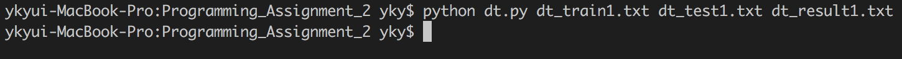
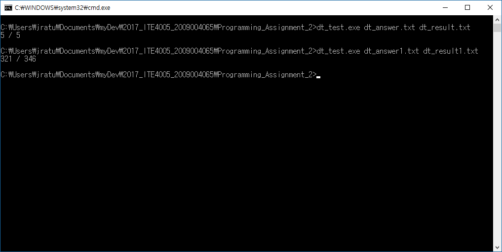

# Data Science Assignment #2  
# Decision Tree  
  
## 1. Environment
* OS : OS X 10.12.4
* Language : Python 2.7.12

 

## 2. How to execute the source code  
  
I used python in OS X environment. So I don't have exe file in this assignment.
You can execute the source code by python command easily.  

> $ python dt.py [training\_file\_name] [test\_file\_name] [output\_file\_name]  

 

## 3. Result of the test  
  
dt_test.txt : 100% (5 / 5)  
dt_test1.txt : 92.77% (321 / 346)  