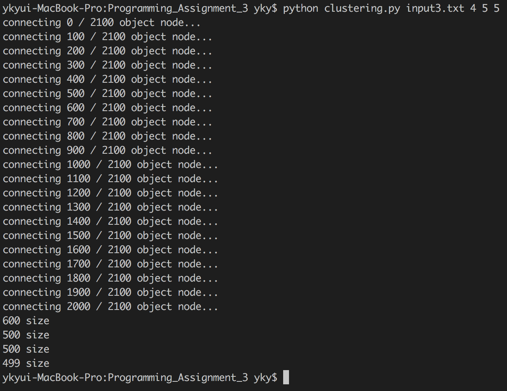

# Data Science Assignment #3  
# Clustering : DBSCAN  
  
## 1. Environment
* OS : OS X 10.12.4
* Language : Python 2.7.12

 

## 2. How to execute the source code  
  
I used python in OS X environment. So I don't have exe file in this assignment.
You can execute the source code by python command easily.  

> $ python clustering.py [input\_file\_name] [number\_of\_clusters] [eps] [minPts]  

 

## 3. Result of the test  
  