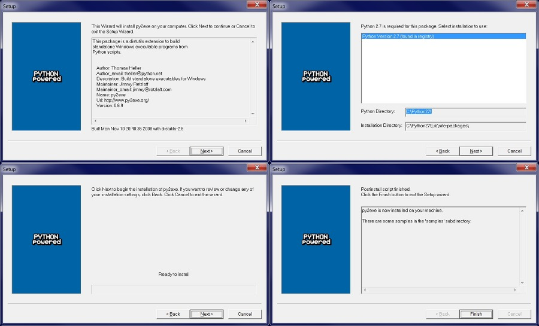
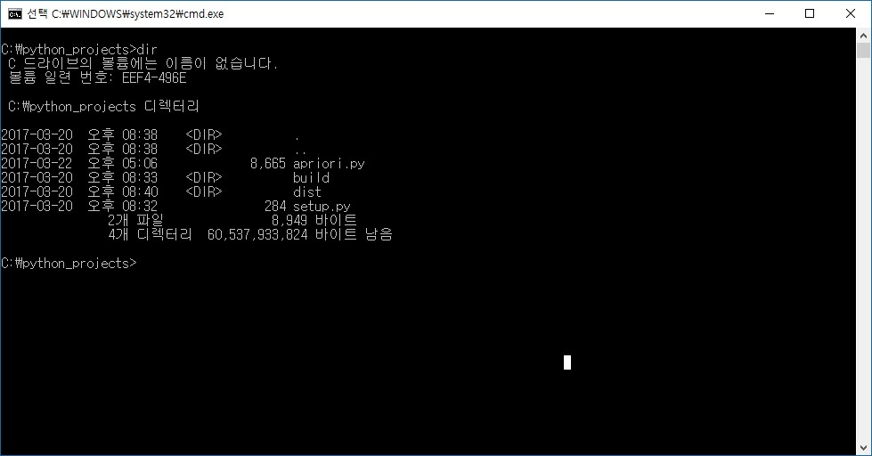
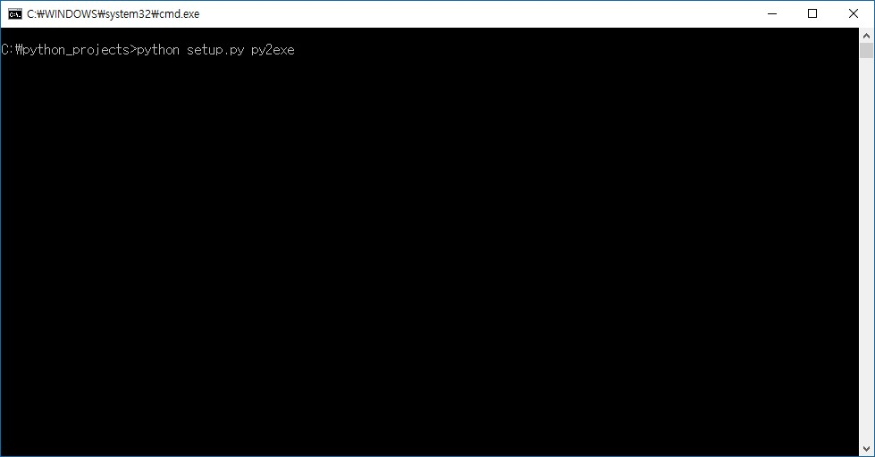
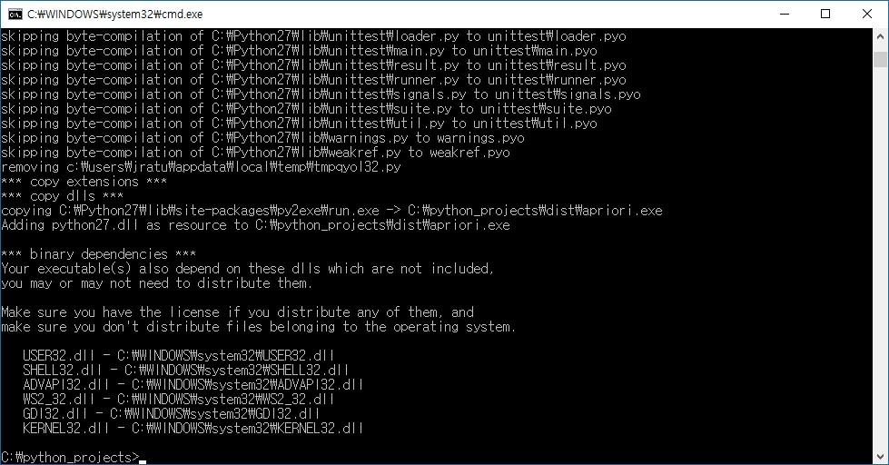
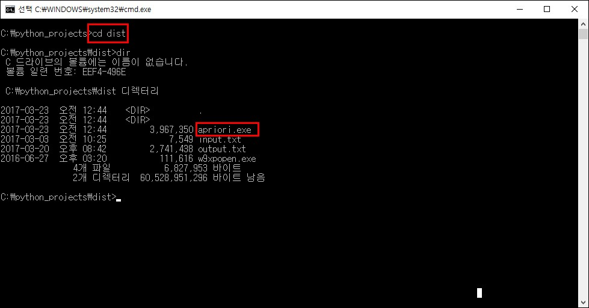
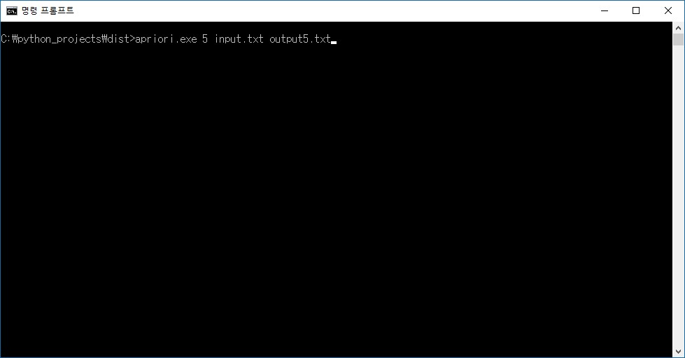
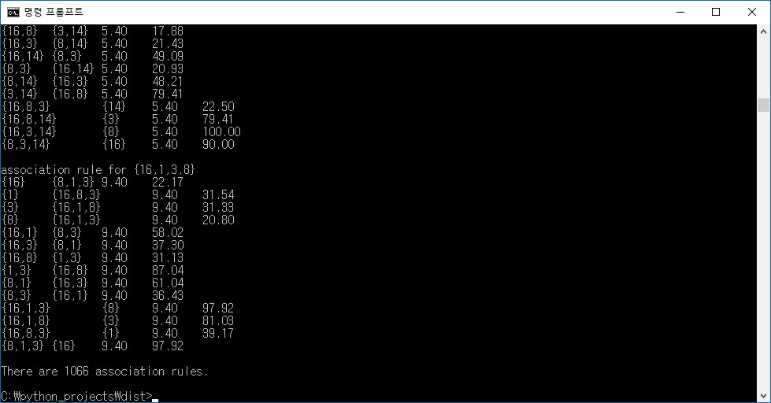
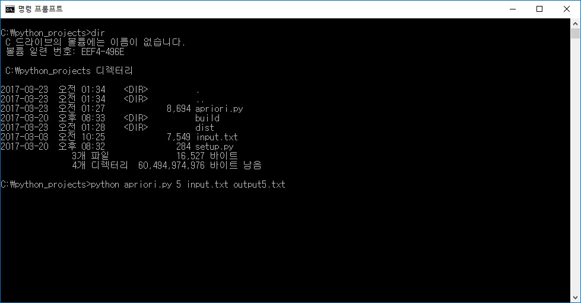
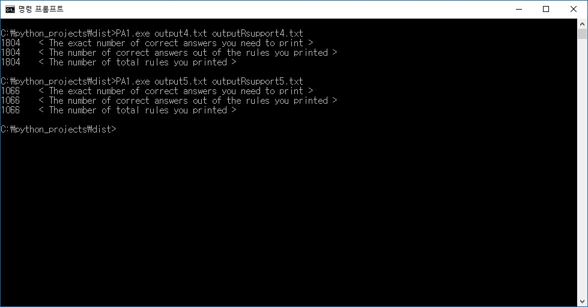

# Data Science Assignment #1  
# Apriori Pruning Algorithm

## 1. Environment
* OS : Windows 10
* Language : Python 2.7.12 

## 2. How to build exe file

(1) You need to install py2exe.  
Connect to the http://py2exe.org , and click 'downloads' button.  
  
  

(2) Download 'py2exe-0.6.9.win32-py2.7.exe'.  
  
  

(3) You can easily install it by clicking 'next' button.  
  
  
  
(4) Move to directory with apriori.py and setup.py.  
I uploaded the setup.py as well. You can use it like a Makefile.  
  
  
  
(5) insert the command.  
  
> $ python setup.py py2exe  
  
  
  
(6) After that, you can get the exe file.
  
  

(7) The exe file will be in the 'dist' folder.
  
  
## 3. How to execute exe file
  

Move to directory with apriori.exe and input file.  
And insert the command.
  
> $ apriori.exe [minimum\_support] [input\_file\_name] [output\_file\_name]  
  
  
  
You can get the answer.  
  
  
## 4. How to test without exe file  
  
  
If you don't want to install py2exe, or your environment can't execute exe file, (ex. OS X) you can easily test it by python command.  
Move to the folder with apriori.py and input file.  
And insert the command.  
  
> $ python apriori.py [minimum\_support] [input\_file\_name] [output\_file\_name]  
  
  
## 5. This program passed the test.
  
  
  
  
## 6. Contact   
  
* email : jratul@nate.com
* mobile : 010-4594-5064  

If you need more information about this, please feel free to contact me.  
Thank you.
